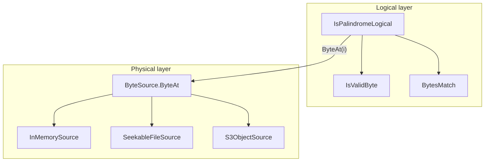

# isPalindrome — specification and architecture (v1)

This document merges the **original v1 product rules**, **acceptance testing conventions**, and **optional** architecture notes (logical vs physical layers, sync `ByteSource`, Option B for async). Canonical machine-readable tests live under [`fixtures/`](fixtures/).

---

## 1. Educational and simplicity goals

The repo is aimed at **learning** and **job interviews**, not production deployment. **Per-language projects should stay as small and simple as practical.**

| Priority | Guidance |
|----------|----------|
| **Readability** | Highest. Code should be easy to follow in one sitting; names and control flow matter more than “enterprise” folder layouts. |
| **File sprawl** | Prefer **fewer, clearer files** over many small files when splitting does not help understanding. Avoid extra files **only** to mirror layers or patterns from large codebases. |
| **Decomposition** | Structure **inside** the reference file: meaningful functions, clear boundaries, and names that teach intent. Maintainability at the **function** level remains important—**not** extra type files for layering. |

### Normative: command-line deliverable (canonical CLI)

The **repository** provides **exactly one** user-facing palindrome CLI: the Rust binary **`is_palindrome_cli`** ([`CLI`](CLI/)). **Invoke it with Bazel** from the repo root (recommended):

```bash
bazel run //CLI:is_palindrome_cli -- [flags] [TEXT...]
```

Examples:

```bash
bazel run //CLI:is_palindrome_cli -- aba
bazel run //CLI:is_palindrome_cli -- --impl py aba
bazel run //CLI:is_palindrome_cli -- --impl all --hex 61ff62
```

| Behavior | Summary |
|----------|---------|
| **Backends** | **`--impl`** selects `py`, `cpp`, `c`, `rust`, `cs`, `nodejs`, or **`all`** (default **`rust`**). Non-Rust backends use **stdin JSON adapters** in each language tree; **`--impl py`** runs [`src/py/is_palindrome/stdin_json_adapter.py`](src/py/is_palindrome/stdin_json_adapter.py) (library only). |
| **Exit codes** | **0** = true, **1** = false, **2** = error (e.g. `NON_ASCII_STRING_INPUT`). Stdout: one line `true` or `false`. |

**Canonical manifest tests** (each row of [`fixtures/acceptance_manifest.json`](fixtures/acceptance_manifest.json) against the **local library in-process**):

```bash
bazel test //...   # includes //src/...:acceptance_test per language
```

**Optional subprocess matrix** (same manifest via **`is_palindrome_cli`** and adapters; **manual** Bazel tag):

```bash
bazel test //fixtures:acceptance_manifest_cli
# or: bazel run //fixtures:cli -- acceptance --impl rust
```

**Native test matrix:** `bazel test //...` (or `bazel run //fixtures:cli -- test-native`, which runs `bazel test //...`).

The Python package [`fixtures/cli/`](fixtures/cli/) is **tooling only** (acceptance runner script and `test-native` wrapper), not the palindrome CLI surface.

**Per-language ports** ship **libraries** and optional **stdin JSON adapters**. **Shared manifest cases** are run **primarily** by each language’s **`acceptance_test`** Bazel target (direct, in-process). A **supplementary** path runs the same manifest through **`is_palindrome_cli`** (see **`//fixtures:acceptance_manifest_cli_*`**, **manual**, and [`fixtures/cli/acceptance_cmd.py`](fixtures/cli/acceptance_cmd.py)). Rust **CLI** checks live under **`//CLI:all_cli_tests`**.

### Normative: single-file core (reference layout)

The **core palindrome logic** should live in **exactly one source file** per language when practical (e.g. C#: [`src/cs/IsPalindrome.cs`](src/cs/IsPalindrome.cs), Python sample: [`src/py/is_palindrome/palindrome.py`](src/py/is_palindrome/palindrome.py)). The **canonical** CLI is the Rust binary **`is_palindrome_cli`** ([`CLI/src/lib.rs`](CLI/src/lib.rs)). Additional files are allowed for **adapters**, **build wiring**, or **tests** when the framework requires a separate harness.

Shared [`fixtures/`](fixtures/) keep behavior aligned across languages without forcing identical file counts.

### Cross-language ports: no runtime coupling

Each language implementation is **self-contained**. Do **not** rely on **FFI** to another language’s library, a **shared compiled binary**, or a single “canonical” runtime that every port must link. Shared [`fixtures/`](fixtures/) JSON and matrices are **portable case data** only. **`is_palindrome_cli`** may **subprocess** to each port’s thin adapter; that does not replace the “no FFI between ports” rule for library code.

### Tight dependency rule

Reference implementations keep third-party surface **minimal**:

| Area | Rule |
|------|------|
| **Core algorithm** (in-memory palindrome over bytes) | **Standard library only**—no ICU, Boost, or extra packages for the core check. |
| **Local seekable file** streaming (if implemented) | **Standard library** plus normal OS / language file I/O; no extra third-party libraries solely for local file access beyond that baseline. |
| **S3 / object streaming** (if implemented) | **Official AWS SDK** for that language (e.g. .NET **AWSSDK.S3**, **aws-sdk-cpp** S3, Python **boto3**, Node **@aws-sdk/client-s3**, Rust **aws-sdk-s3**). Use it for object metadata, ranged **GetObject**, and the SDK’s default credential chain. **Do not** ship a custom HTTPS / SigV4 client just for S3. |
| **C** | Core: **ISO C + libc**. For S3, use an **AWS-documented** C stack (e.g. **AWS CRT** / **aws-c-s3**), not ad-hoc TLS/signing code. |

### Complexity and threading

- **Time:** **O(n)** over bytes examined in the worst case; **sublinear-time** palindrome detection is **out of scope** for this repo.
- **Space:** The in-memory path uses **O(1)** extra space besides the input; streaming paths use **O(buffer size)** memory bounded independently of object size, not **O(total input size)** loaded whole.
- **Threading:** A **single-threaded** logical loop is **sufficient** and matches the teaching goal. Overlapping or parallel I/O for left/right reads (e.g. on S3) is an optional implementation detail, not a requirement.

---

## 2. Problem and byte model

- Inputs are treated as a **sequence of bytes** (dual inward cursors `L` / `R`).
- **Vacuous truth:** if there is no pair of valid bytes left to compare (empty sequence or only delimiters), the result is **true**.

### Validity and delimiters

The spec does **not** require a dedicated “options” object in code. Behavior is defined as follows.

**Default rule (always):** “Valid” bytes that participate in comparison after skipping delimiters are ASCII **`a-z`**, **`A-Z`**, **`0-9`**. Every **other** byte is a **delimiter** (skipped): spaces, punctuation, control characters, bytes **`0x80`–`0xFF`**, etc.

**Optional custom delimiters:** When a caller or fixture supplies an explicit set of bytes (e.g. manifest `invalid_bytes_hex` with `invalid_mode: custom`), those bytes are treated as **additional** delimiters—i.e. they are skipped and never compared as part of the alnum content. Semantics match the former “custom invalid set” behavior **when the set is non-empty**.

**Fallback:** If `custom` is indicated but the delimiter set is **missing or empty**, behavior is **identical to the default rule** (ASCII alnum valid; everything else delimiter). **No** exception and **no** error code for “empty custom set.”

### Letter comparison (fixed policy)

- ASCII letters **`A–Z`** and **`a–z`** compare equal pairwise (**ASCII case-folding**). There is **no** case-sensitive mode; the project is case-insensitive only.

### High bytes

- Under the default alnum rule, bytes **`≥ 0x80`** are **never** valid characters; they act as delimiters (see [`fixtures/acceptance_matrix.md`](fixtures/acceptance_matrix.md) `REQ-HIGH-BYTE-DELIM`).

---

## 3. String API (C#/JS-style string entry points)

- **Allowed:** Unicode scalars in **`U+0000`–`U+007F`** (ASCII). Content is encoded to bytes for the same logical check as the byte API.
- **Rejected:** any scalar **`> U+007F`** → error code **`NON_ASCII_STRING_INPUT`** (see manifest `error_codes`).
- **Byte-only** implementations may omit string entry points and skip manifest cases tagged for string APIs.

---

## 4. Acceptance tests and fixtures

### Source of truth

| Artifact | Role |
|----------|------|
| [`fixtures/acceptance_manifest.json`](fixtures/acceptance_manifest.json) | All cases (JSON). |
| [`fixtures/acceptance_matrix.md`](fixtures/acceptance_matrix.md) | Requirement IDs → test IDs. |
| [`fixtures/README.md`](fixtures/README.md) | Harness rules, strict TDD process, string-case notes. |

### Spec vs fixtures

**This document (§2–§4) is authoritative for target behavior.** The manifest and matrix may still list legacy cases or error codes until they are updated; implementers should align code with **this spec** and track fixture updates separately.

### Harness rules (summary)

1. Parse `acceptance_manifest.json`.
2. Build bytes: `input_ascii` → UTF-8 / Latin-1 as documented; `input_hex` → decode hex pairs (lowercase in manifest).
3. **`invalid_mode` / `invalid_bytes_hex`:** if `invalid_mode` is `custom` and `invalid_bytes_hex` is **non-empty**, those bytes are custom delimiters (§2). If **empty or absent**, use **default** validity (§2 fallback).
4. Skip cases where `applies_to` lists only runtimes you do not implement.
5. **`expected.kind`:** `"boolean"` → assert result; `"error"` → assert exception / error code `expected.code`.
6. **`pal-stream-note-001`:** metadata only — manually verify streaming (file/S3) matches in-memory for referenced cases.
7. **CLI contract (supplementary):** when using `is_palindrome_cli`, exit codes and stdout/stderr must match §2–§3; the **`//fixtures:acceptance_manifest_cli`** **`test_suite`** (**manual**) exercises that path. **Canonical** behavioral coverage is the per-language **`acceptance_test`** targets (§1).

### Requirement traceability (abbreviated)

See [`fixtures/acceptance_matrix.md`](fixtures/acceptance_matrix.md) for the full table. Examples:

- **REQ-CORE-LOOP** — dual-cursor core; **REQ-DEFAULT-ALNUM** — default alnum rules.
- **REQ-STRING-API-NON-ASCII** — string rejects `> U+007F` (`pal-str-002`, `pal-str-004`).
- **REQ-STREAM-BYTES** — streaming equivalence (`pal-stream-note-001`, manual).

### Error codes (normative product surface)

| Code | Meaning |
|------|---------|
| `NON_ASCII_STRING_INPUT` | String scalar `> U+007F`. |

The code **`EMPTY_CUSTOM_INVALID_SET`** is **deprecated** for the target product: empty custom delimiter sets do not throw (§2). The manifest may still contain legacy rows until removed.

---

## 5. Implementation process (strict TDD)

1. **Red** — Add or change a row in [`acceptance_manifest.json`](fixtures/acceptance_manifest.json), or add **exactly one** new failing test that encodes the next behavior. Run the suite and **confirm failure** before writing production code.
2. **No production code before red** — Do **not** add or change production code (CLI, core logic, shared modules) until the failure in step 1 is observed.
3. **Green** — Write the **smallest** change that makes the test(s) pass.
4. **Refactor** — Only with a full green suite; keep behavior covered by the same tests.

Acceptance-level means tests driven by the shared manifest (or equivalent), not ad-hoc tests that invent requirements.

**Bulk rewrites** of the codebase without intermediate failing tests are **out of scope** for this repo’s process unless explicitly exempted (e.g. mechanical rename).

---

## 6. Architecture (optional): logical palindrome vs physical `ByteSource`

The **primary** teaching artifact is **one logical function** over a byte span (and, for string APIs, validation + encoding to bytes). File, S3, and `ByteSource` are **optional extensions** for readers who already understand the core loop.

### Goals (when using streaming / random access)

- **Teaching:** One readable function contains the **entire** palindrome story (two cursors, skip delimiters, compare, shrink window).
- **Separation:** **Logical** indices `L`, `R` and rules (`IsValidByte`, `BytesMatch`) stay in that function. **Physical** code maps a logical index to a byte (memory, seekable file, S3) and handles buffering; it does **not** encode palindrome rules.

### Window / boundaries

Skipping delimiters from the **left** must stop at the **far edge of the current pair window**. Advancing `L` only while `L < length` (ignoring `R`) can pair bytes outside the intended window. The correct guard is **`L <= R`** while skipping (or an equivalent inclusive boundary in a tiny helper). That invariant belongs with the **logical** loop.

### Logical vs physical layers

| Layer | Responsibility |
|-------|----------------|
| **Logical** | `L`, `R`, `length`; `while (L <= R && …)` skip loops; `BytesMatch`; termination. |
| **Physical** | `ByteSource.ByteAt(i)` — return the *i*-th byte; internally: caches, seek, S3 ranged GETs. No palindrome semantics. |

### Pseudo-code (no “options object” required)

`customDelimiters` may be `null` or empty (meaning: use default rule only).

```text
function IsPalindromeLogical(length, source: ByteSource, customDelimiters: byte set or null):
    L = 0
    R = length - 1

    loop forever:
        while L <= R and not IsValidByte(source.ByteAt(L), customDelimiters):
            L++
        while L <= R and not IsValidByte(source.ByteAt(R), customDelimiters):
            R--
        if L >= R:
            return true
        if not BytesMatch(source.ByteAt(L), source.ByteAt(R)):
            return false
        L++
        R--
```

```text
interface ByteSource:
    ByteAt(i: int64) -> byte
```

Implementations (physical only): e.g. in-memory array, seekable file with chunk cache, S3 object with HEAD + ranged GETs behind `ByteAt`.



### Async and S3: Option B (chosen)

**Shape:** The logical loop uses **synchronous** `ByteAt(i)` only. **Async** (`async`/`await`, S3 client, ranged downloads, prefetch) lives **inside** physical `ByteSource` implementations (e.g. a cache that fills chunks on miss using async I/O, while exposing a sync API to the algorithm).

**Rationale**

- **Clarity:** Short, synchronous, pseudocode-friendly loop for teaching and ports.
- **Encapsulation:** Network and concurrency stay in the adapter; the algorithm does not carry `Task`, `CancellationToken`, or `await` at the top level.
- **Same story as RAM:** In-memory is `buffer[i]`; file/S3 are `ByteAt` with more machinery underneath.

**Costs (accepted):** Prefetch/cache correctness; blocking sync-over-async on a miss is a risk in some hosts unless ranges are pre-warmed or usage is constrained. Very large objects may need streaming policy **inside** the physical layer without changing the logical API.

### Reference implementation (Python — sample + CLI harness)

**[`src/py/is_palindrome/palindrome.py`](src/py/is_palindrome/palindrome.py)** — sample core (`is_palindrome`, `is_palindrome_from_utf8`). **`//src/py:acceptance_test`** runs manifest cases in-process; **`//fixtures:acceptance_manifest_cli_py`** (**manual**) runs them through **`is_palindrome_cli`**.

### Reference implementation (C#)

**[`src/cs/IsPalindrome.cs`](src/cs/IsPalindrome.cs)** — library (`Palindrome.IsPalindrome`, `Palindrome.IsPalindromeFromUtf8`); **[`src/cs/StdinJsonAdapter/`](src/cs/StdinJsonAdapter/)** — stdin JSON adapter for **`--impl cs`**. No in-repo xUnit project; **`//fixtures:acceptance_manifest_cli_cs`** is the automated manifest gate. Teaching sketches may use [`foo.cs`](foo.cs) at the repo root.

### Reference implementation (C++)

**[`src/cpp/src/IsPalindrome.cpp`](src/cpp/src/IsPalindrome.cpp)** and **[`src/cpp/include/IsPalindrome.hpp`](src/cpp/include/IsPalindrome.hpp)** — core library (`palindrome::is_palindrome`, `palindrome::is_palindrome_from_utf8`). **`//src/cpp:acceptance_test`** (manifest, in-process); optional **`//fixtures:acceptance_manifest_cli_cpp`** (**manual**, via CLI).

### Reference implementation (Rust)

**[`src/rust/is_palindrome/src/lib.rs`](src/rust/is_palindrome/src/lib.rs)** — core library (`is_palindrome`, `is_palindrome_from_utf8` with `Result`). **[`CLI/src/lib.rs`](CLI/src/lib.rs)** — canonical **`is_palindrome_cli`**. The Rust **stdin JSON adapter** ([`CLI/src/bin/stdin_json_adapter.rs`](CLI/src/bin/stdin_json_adapter.rs)) is used for **`--impl rust`** when explicit. **`//src/rust/is_palindrome:acceptance_test`** (manifest, in-process); optional **`//fixtures:acceptance_manifest_cli_rust`** (**manual**).

### Reference implementation (Node.js)

**[`src/nodejs/ispalindrome/isPalindrome.js`](src/nodejs/ispalindrome/isPalindrome.js)** — core library (`isPalindrome`, `isPalindromeFromUtf8`; `PalindromeError`). **No runtime npm dependencies** for the core. Coverage: **`bazel coverage`** on **`//src/nodejs/ispalindrome:acceptance_test`** (see [`tools/coverage/coverage_html.sh`](tools/coverage/coverage_html.sh)). **`//src/nodejs/ispalindrome:acceptance_test`** (manifest, in-process); optional **`//fixtures:acceptance_manifest_cli_nodejs`** (**manual**).

### Reference implementation (C)

**[`src/c/src/is_palindrome.c`](src/c/src/is_palindrome.c)** / **[`src/c/include/is_palindrome.h`](src/c/include/is_palindrome.h)** — core library (**ISO C + libc** only: `is_palindrome`, `is_palindrome_from_utf8`). Stdin JSON adapter: **`src/c/src/stdin_json_adapter.c`** (cJSON via Bazel, not linked into the core library). **`//src/c:acceptance_test`** (manifest, in-process); optional **`//fixtures:acceptance_manifest_cli_c`** (**manual**).

---

## 7. Document history

| Source | Contents merged here |
|--------|----------------------|
| [`fixtures/acceptance_manifest.json`](fixtures/acceptance_manifest.json), [`fixtures/acceptance_matrix.md`](fixtures/acceptance_matrix.md), [`fixtures/README.md`](fixtures/README.md) | v1 rules, harness, requirements, error codes |
| Architecture plan (logical `ByteSource`, US-ASCII alnum default, Option B async) | §6 and §2; previously maintained alongside this spec in Cursor |
| **2025 revision** | §1 single-file norm; §2 validity without required options type + empty-custom fallback; §4 `EMPTY_CUSTOM_INVALID_SET` deprecated; §5 strict TDD steps + bulk-rewrite rule; §6 optional streaming architecture; one-file C# target |
| **2025 revision (deps)** | §1 no cross-language runtime deps (no FFI / shared binaries); tight dependency rule (stdlib vs AWS SDK for S3); complexity **O(n)** and single-threaded logical design |
| **2025 revision (CLI)** | §1 normative **command-line deliverable** (executable or script); library-only artifacts insufficient; single-file rule reframed as **core logic** with optional small CLI entry file; historical `fixtures/cli_manifest.json` + §4 harness item 7 |
| **2025 revision (canonical CLI)** | §1 **single** Python canonical CLI; C#/C++ library-only ports + `acceptance_manifest` only; historical `fixtures/cli_manifest.json` + §4 harness item 7 apply to Python |
| **2025 revision (CLI location)** | Canonical CLI moved to `fixtures/python_cli/` (removed in 2026); sample core remains [`src/py/is_palindrome/`](src/py/is_palindrome/) |
| **2026 revision (Rust CLI)** | §1 Canonical palindrome CLI is **`is_palindrome_cli`** (`bazel run //CLI:is_palindrome_cli`); **`//fixtures:acceptance_manifest_cli`** for manifest E2E; Python **`fixtures.cli`** limited to **`acceptance`** + **`test-native`** tooling (Python **`check`** removed); prior **`fixtures.cli`** dispatcher + `cli_manifest.json` history folded into earlier rows |


# Project goals — isPalindrome

*Draft for review. Derived from `README.md`, `SPEC.md`, `fixtures/README.md`, `fixtures/acceptance_manifest.json`, `.cursor/rules/strict-tdd.mdc`, and `docs/test-strategy.md`.*

---

## 1. Purpose and audience

- **Primary purpose:** Multi-language **exercise and reference** for **ASCII / byte-sequence palindrome** detection, with **shared acceptance fixtures** and one canonical CLI.
- **Audience / intent:** **Learning** and **job interviews**, not production deployment.
- **Product scope:** “v1” behavior as defined in `SPEC.md` and encoded in `fixtures/acceptance_manifest.json` (schema_version 1: ASCII bytes, dual cursors).

---

## 2. Educational and simplicity goals

- **Readability first:** Code should be easy to follow in one sitting; names and control flow beat “enterprise” structure.
- **Low file sprawl:** Prefer **fewer, clearer files**; avoid extra files only to mirror layers from large codebases.
- **Decomposition inside files:** Use meaningful functions and clear boundaries **within** the main implementation file rather than many small type files.
- **Core in one file (when practical):** Palindrome **core logic** should live in **exactly one source file per language** (adapters, build wiring, and tests may be separate where required).

---

## 3. Cross-language and architectural goals

- **Self-contained ports:** Each language implementation is **independent** — **no FFI**, no shared runtime library every port must link. Shared JSON fixtures are **data only**.
- **Canonical user surface:** **Exactly one** user-facing palindrome CLI: Rust **`is_palindrome_cli`** under `CLI/`, invoked preferably via **Bazel** (`bazel run //CLI:is_palindrome_cli -- …`).
- **All backends:** Exposed via **thin stdin JSON adapters** subprocessed by the CLI; no runtime coupling between language libraries.
- **CLI contract:** Exit codes **0** = true, **1** = false, **2** = error; stdout: one line `true` or `false`. Backend selection via **`--impl`** (`py`, `cpp`, `c`, `rust`, `cs`, `nodejs`, `all`, default `rust`).

---

## 4. Behavioral / product goals (v1)

- **Byte model:** Input is a **sequence of bytes**; **dual inward cursors** (`L` / `R`).
- **Vacuous truth:** If no pair of valid bytes remains (empty or only delimiters), result is **true**.
- **Default validity:** Compared bytes are ASCII **alphanumeric** (`a-z`, `A-Z`, `0-9`); **all other bytes are delimiters** (skipped), including high bytes **≥ 0x80**.
- **Custom delimiters (optional):** Non-empty `invalid_bytes_hex` under `invalid_mode: custom` adds **additional** delimiter bytes; **empty or missing set falls back to default** alnum rule (no dedicated error for empty custom set).
- **Letters:** **ASCII case-insensitive** pairing (`A–Z` / `a–z`); **no** case-sensitive mode.
- **Digits:** Compared with **exact byte equality** (not letter folding).
- **String API (where implemented):** Scalars **U+0000–U+007F** only; scalars **> U+007F** → error **`NON_ASCII_STRING_INPUT`**. Byte-only APIs may omit string entry points and skip `pal-str-*` cases per `applies_to`.
- **Streaming (optional extension):** File/S3 (or similar) should **match in-memory** results for the same bytes; `pal-stream-note-001` is a **manual** equivalence reminder.

---

## 5. Complexity and dependency goals

- **Time:** **O(n)** over bytes examined (sublinear palindrome detection out of scope).
- **Space (in-memory):** **O(1)** extra beyond the input; streaming: **O(buffer)**, not **O(total input size)** loaded whole.
- **Threading:** **Single-threaded** logical loop is sufficient and aligned with teaching goals.
- **Dependencies:**
  - **Core algorithm:** **Standard library only** (no ICU/Boost/extra packages for the core check).
  - **Local file I/O:** Standard library + normal OS/file APIs.
  - **S3 (if implemented):** **Official AWS SDK** for that language; no ad-hoc SigV4/TLS client for S3.
  - **C:** Core **ISO C + libc**; S3 via **AWS-documented** C stack (e.g. CRT / aws-c-s3).

---

## 6. Testing, acceptance, and process goals

- **Single source of truth for shared behavior:** `fixtures/acceptance_manifest.json`, with traceability in `fixtures/acceptance_matrix.md`.
- **End-to-end acceptance:** Manifest cases run through **`is_palindrome_cli`** (Bazel: `//fixtures:acceptance_manifest_cli` and shards per backend; Python harness under `fixtures/cli/`).
- **Strict TDD (repo rule):** **Red → green → refactor** — no new production behavior without a **failing acceptance-level test first** (typically manifest and/or harness). Smallest change to green; refactor only on green. No features or refactors unless an acceptance-level test would fail without them (tooling, config, test/fixture code that drives the next red, and explanatory docs are exceptions as documented in the rule).
- **CI alignment:** **Bazel-first** (`bazel test //...`); Rust CLI covered by `//CLI:all_cli_tests` plus manifest CLI suites.

---

## 7. Tooling and environment goals (supporting the above)

- **Reproducible dev:** Dev container and docs (`CONTRIBUTING.md`) support consistent toolchains.
- **Coverage / reports:** Optional scripts under `tools/` and `reports/` (gitignored output) for coverage workflows where applicable.

---

## 8. Non-goals (explicit or implied)

- Production deployment as a primary objective.
- Sublinear-time palindrome algorithms.
- Unicode / full UTF-8 semantics beyond the defined string API boundary (reject non-ASCII scalars at string API).
- Cross-language runtime coupling or a single shared “canonical” library all ports must use.
- Bulk rewrites without intermediate failing tests (unless explicitly exempted).

---

## Revision notes

Use this section for your edits, open questions, or priority changes.

- 
- 
- 
