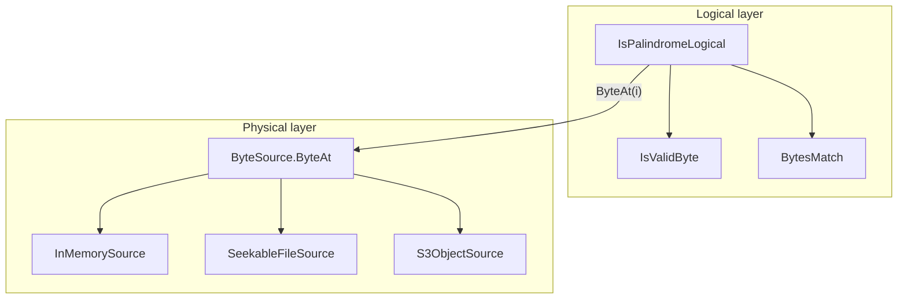

# isPalindrome — specification and architecture (v1)

This document merges the **original v1 product rules**, **acceptance testing conventions**, and **optional** architecture notes (logical vs physical layers, sync `ByteSource`, Option B for async). Canonical machine-readable tests live under [`fixtures/`](fixtures/).

---

## 1. Educational and simplicity goals

The repo is aimed at **learning** and **job interviews**, not production deployment. **Per-language projects should stay as small and simple as practical.**

| Priority | Guidance |
|----------|----------|
| **Readability** | Highest. Code should be easy to follow in one sitting; names and control flow matter more than “enterprise” folder layouts. |
| **File sprawl** | Prefer **fewer, clearer files** over many small files when splitting does not help understanding. Avoid extra files **only** to mirror layers or patterns from large codebases. |
| **Decomposition** | Structure **inside** the reference file: meaningful functions, clear boundaries, and names that teach intent. Maintainability at the **function** level remains important—**not** extra type files for layering. |

### Normative: single-file reference implementation

For each language, the **reference library** (public API + helpers) lives in **exactly one source file** (e.g. C#: one `.cs` file under [`cs/`](cs/) such as `IsPalindrome.cs`). A **second** file or project is allowed **only** for tests when the test framework requires it (e.g. xUnit project referencing the library).

Shared [`fixtures/`](fixtures/) keep behavior aligned across languages without forcing identical file counts.

---

## 2. Problem and byte model

- Inputs are treated as a **sequence of bytes** (dual inward cursors `L` / `R`).
- **Vacuous truth:** if there is no pair of valid bytes left to compare (empty sequence or only delimiters), the result is **true**.

### Validity and delimiters

The spec does **not** require a dedicated “options” object in code. Behavior is defined as follows.

**Default rule (always):** “Valid” bytes that participate in comparison after skipping delimiters are ASCII **`a-z`**, **`A-Z`**, **`0-9`**. Every **other** byte is a **delimiter** (skipped): spaces, punctuation, control characters, bytes **`0x80`–`0xFF`**, etc.

**Optional custom delimiters:** When a caller or fixture supplies an explicit set of bytes (e.g. manifest `invalid_bytes_hex` with `invalid_mode: custom`), those bytes are treated as **additional** delimiters—i.e. they are skipped and never compared as part of the alnum content. Semantics match the former “custom invalid set” behavior **when the set is non-empty**.

**Fallback:** If `custom` is indicated but the delimiter set is **missing or empty**, behavior is **identical to the default rule** (ASCII alnum valid; everything else delimiter). **No** exception and **no** error code for “empty custom set.”

### Letter comparison (fixed policy)

- ASCII letters **`A–Z`** and **`a–z`** compare equal pairwise (**ASCII case-folding**). There is **no** case-sensitive mode; the project is case-insensitive only.

### High bytes

- Under the default alnum rule, bytes **`≥ 0x80`** are **never** valid characters; they act as delimiters (see [`fixtures/acceptance_matrix.md`](fixtures/acceptance_matrix.md) `REQ-HIGH-BYTE-DELIM`).

---

## 3. String API (C#/JS-style string entry points)

- **Allowed:** Unicode scalars in **`U+0000`–`U+007F`** (ASCII). Content is encoded to bytes for the same logical check as the byte API.
- **Rejected:** any scalar **`> U+007F`** → error code **`NON_ASCII_STRING_INPUT`** (see manifest `error_codes`).
- **Byte-only** implementations may omit string entry points and skip manifest cases tagged for string APIs.

---

## 4. Acceptance tests and fixtures

### Source of truth

| Artifact | Role |
|----------|------|
| [`fixtures/acceptance_manifest.json`](fixtures/acceptance_manifest.json) | All cases (JSON). |
| [`fixtures/acceptance_matrix.md`](fixtures/acceptance_matrix.md) | Requirement IDs → test IDs. |
| [`fixtures/README.md`](fixtures/README.md) | Harness rules, strict TDD process, string-case notes. |

### Spec vs fixtures

**This document (§2–§4) is authoritative for target behavior.** The manifest and matrix may still list legacy cases or error codes until they are updated; implementers should align code with **this spec** and track fixture updates separately.

### Harness rules (summary)

1. Parse `acceptance_manifest.json`.
2. Build bytes: `input_ascii` → UTF-8 / Latin-1 as documented; `input_hex` → decode hex pairs (lowercase in manifest).
3. **`invalid_mode` / `invalid_bytes_hex`:** if `invalid_mode` is `custom` and `invalid_bytes_hex` is **non-empty**, those bytes are custom delimiters (§2). If **empty or absent**, use **default** validity (§2 fallback).
4. Skip cases where `applies_to` lists only runtimes you do not implement.
5. **`expected.kind`:** `"boolean"` → assert result; `"error"` → assert exception / error code `expected.code`.
6. **`pal-stream-note-001`:** metadata only — manually verify streaming (file/S3) matches in-memory for referenced cases.

### Requirement traceability (abbreviated)

See [`fixtures/acceptance_matrix.md`](fixtures/acceptance_matrix.md) for the full table. Examples:

- **REQ-CORE-LOOP** — dual-cursor core; **REQ-DEFAULT-ALNUM** — default alnum rules.
- **REQ-STRING-API-NON-ASCII** — string rejects `> U+007F` (`pal-str-002`, `pal-str-004`).
- **REQ-STREAM-BYTES** — streaming equivalence (`pal-stream-note-001`, manual).

### Error codes (normative product surface)

| Code | Meaning |
|------|---------|
| `NON_ASCII_STRING_INPUT` | String scalar `> U+007F`. |

The code **`EMPTY_CUSTOM_INVALID_SET`** is **deprecated** for the target product: empty custom delimiter sets do not throw (§2). The manifest may still contain legacy rows until removed.

---

## 5. Implementation process (strict TDD)

1. **Red** — Add or change a row in [`acceptance_manifest.json`](fixtures/acceptance_manifest.json), or add **exactly one** new failing test that encodes the next behavior. Run the suite and **confirm failure** before writing production code.
2. **No production code before red** — Do **not** add or change library code until the failure in step 1 is observed.
3. **Green** — Write the **smallest** change that makes the test(s) pass.
4. **Refactor** — Only with a full green suite; keep behavior covered by the same tests.

Acceptance-level means tests driven by the shared manifest (or equivalent), not ad-hoc tests that invent requirements.

**Bulk rewrites** of the codebase without intermediate failing tests are **out of scope** for this repo’s process unless explicitly exempted (e.g. mechanical rename).

---

## 6. Architecture (optional): logical palindrome vs physical `ByteSource`

The **primary** teaching artifact is **one logical function** over a byte span (and, for string APIs, validation + encoding to bytes). File, S3, and `ByteSource` are **optional extensions** for readers who already understand the core loop.

### Goals (when using streaming / random access)

- **Teaching:** One readable function contains the **entire** palindrome story (two cursors, skip delimiters, compare, shrink window).
- **Separation:** **Logical** indices `L`, `R` and rules (`IsValidByte`, `BytesMatch`) stay in that function. **Physical** code maps a logical index to a byte (memory, seekable file, S3) and handles buffering; it does **not** encode palindrome rules.

### Window / boundaries

Skipping delimiters from the **left** must stop at the **far edge of the current pair window**. Advancing `L` only while `L < length` (ignoring `R`) can pair bytes outside the intended window. The correct guard is **`L <= R`** while skipping (or an equivalent inclusive boundary in a tiny helper). That invariant belongs with the **logical** loop.

### Logical vs physical layers

| Layer | Responsibility |
|-------|----------------|
| **Logical** | `L`, `R`, `length`; `while (L <= R && …)` skip loops; `BytesMatch`; termination. |
| **Physical** | `ByteSource.ByteAt(i)` — return the *i*-th byte; internally: caches, seek, S3 ranged GETs. No palindrome semantics. |

### Pseudo-code (no “options object” required)

`customDelimiters` may be `null` or empty (meaning: use default rule only).

```text
function IsPalindromeLogical(length, source: ByteSource, customDelimiters: byte set or null):
    L = 0
    R = length - 1

    loop forever:
        while L <= R and not IsValidByte(source.ByteAt(L), customDelimiters):
            L++
        while L <= R and not IsValidByte(source.ByteAt(R), customDelimiters):
            R--
        if L >= R:
            return true
        if not BytesMatch(source.ByteAt(L), source.ByteAt(R)):
            return false
        L++
        R--
```

```text
interface ByteSource:
    ByteAt(i: int64) -> byte
```

Implementations (physical only): e.g. in-memory array, seekable file with chunk cache, S3 object with HEAD + ranged GETs behind `ByteAt`.



### Async and S3: Option B (chosen)

**Shape:** The logical loop uses **synchronous** `ByteAt(i)` only. **Async** (`async`/`await`, S3 client, ranged downloads, prefetch) lives **inside** physical `ByteSource` implementations (e.g. a cache that fills chunks on miss using async I/O, while exposing a sync API to the algorithm).

**Rationale**

- **Clarity:** Short, synchronous, pseudocode-friendly loop for teaching and ports.
- **Encapsulation:** Network and concurrency stay in the adapter; the algorithm does not carry `Task`, `CancellationToken`, or `await` at the top level.
- **Same story as RAM:** In-memory is `buffer[i]`; file/S3 are `ByteAt` with more machinery underneath.

**Costs (accepted):** Prefetch/cache correctness; blocking sync-over-async on a miss is a risk in some hosts unless ranges are pre-warmed or usage is constrained. Very large objects may need streaming policy **inside** the physical layer without changing the logical API.

### Reference implementation (C#)

The **intended** layout is **one library file** (e.g. `cs/IsPalindrome.cs`) plus a test project. Multi-file class libraries under `cs/` are **not** the target shape for this repo. Teaching sketches may use [`foo.cs`](foo.cs) at the repo root.

---

## 7. Document history

| Source | Contents merged here |
|--------|----------------------|
| [`fixtures/acceptance_manifest.json`](fixtures/acceptance_manifest.json), [`fixtures/acceptance_matrix.md`](fixtures/acceptance_matrix.md), [`fixtures/README.md`](fixtures/README.md) | v1 rules, harness, requirements, error codes |
| Architecture plan (logical `ByteSource`, US-ASCII alnum default, Option B async) | §6 and §2; previously maintained alongside this spec in Cursor |
| **2025 revision** | §1 single-file norm; §2 validity without required options type + empty-custom fallback; §4 `EMPTY_CUSTOM_INVALID_SET` deprecated; §5 strict TDD steps + bulk-rewrite rule; §6 optional streaming architecture; one-file C# target |
